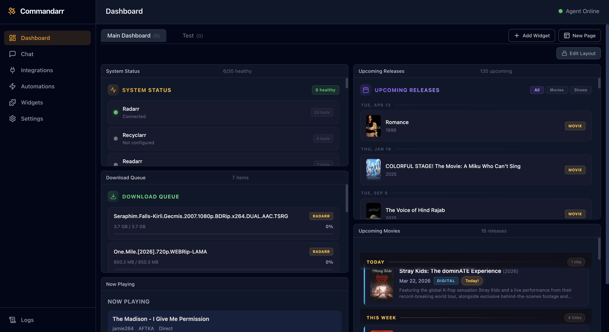
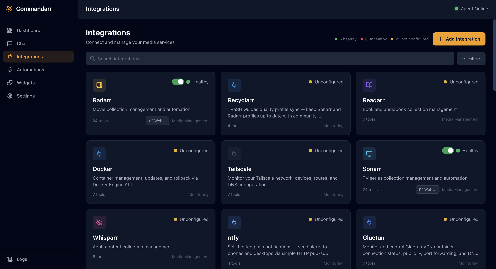

<p align="center">
  
</p>

<h3 align="center">The AI brain for your media stack. One interface for everything.</h3>

<p align="center">
  Commandarr is an AI agent that talks to your entire Plex/Jellyfin/Emby + *arr ecosystem.<br/>
  Ask it questions in plain English. It figures out which services to query, takes action, and reports back.<br/>
  <b>Describe any dashboard widget and it builds it instantly. Need an integration that doesn't exist? It writes one for you.</b><br/>
  From your couch, your phone, or a Telegram message.
</p>

<p align="center">
  <a href="#install">One-Command Install</a> &bull;
  <a href="#what-can-it-do">What Can It Do?</a> &bull;
  <a href="#supported-integrations">37+ Integrations</a> &bull;
  <a href="#screenshots">Screenshots</a> &bull;
  <a href="https://github.com/braedonsaunders/commandarr/wiki">Docs</a>
</p>

---

<p align="center">
  <br/>
  <em>Dashboard — system status, download queue, now playing, and upcoming releases at a glance</em>
</p>

## The Problem

You're running Plex, Sonarr, Radarr, Prowlarr, qBittorrent, Bazarr, Overseerr, and Tautulli. Maybe Lidarr too. Every one of them has its own web UI. Checking what's downloading means opening one tab. Seeing who's streaming means another. Approving a request? Another. Figuring out why something stalled? Good luck — that's three tabs and some detective work.

### What makes Commandarr different

- **Dynamic UI generation** — Describe any dashboard widget and the AI builds it instantly. No templates, no presets. Every dashboard is unique to you.
- **Self-extending** — Need an integration that doesn't exist? Tell the agent to build one. It writes the full integration from scratch — manifest, API client, tools — and it's live immediately.
- **Cross-service reasoning** — The agent connects dots across your entire stack. It doesn't just query one API — it correlates data from Plex, Sonarr, qBittorrent, Prowlarr, and whatever else you're running to actually answer your question.
- **Natural language automations** — No cron syntax. Just say *"every morning at 9am, send me a download summary on Telegram"* and it's done.

---

## Install

One command. Handles install, config, and updates. Your data persists across updates automatically.

**Linux / macOS:**
```bash
curl -fsSL https://raw.githubusercontent.com/braedonsaunders/commandarr/main/install.sh | bash
```

**Windows** (PowerShell as Admin):
```powershell
iwr https://raw.githubusercontent.com/braedonsaunders/commandarr/main/install.ps1 -OutFile install.ps1; powershell -ExecutionPolicy Bypass -File install.ps1
```

The installer checks Docker, asks a few questions (port, auth, Telegram token, Plex setup), generates your `docker-compose.yml`, pulls the image, and starts it. Run the same command again to update.

<details>
<summary><b>Or use Docker Compose directly</b></summary>

```yaml
services:
  commandarr:
    image: ghcr.io/braedonsaunders/commandarr:latest
    container_name: commandarr
    ports:
      - 8484:8484
    volumes:
      - ./data:/app/data
      - ./integrations:/app/custom-integrations
    environment:
      - PORT=8484
      # - AUTH_USERNAME=admin
      # - AUTH_PASSWORD=changeme
      # - TELEGRAM_BOT_TOKEN=your-token
    restart: unless-stopped
```

</details>

### Requirements

- [Docker](https://docker.com/products/docker-desktop)
- An LLM API key — [OpenRouter](https://openrouter.ai) (recommended), [OpenAI](https://platform.openai.com), [Anthropic](https://console.anthropic.com), [Google Gemini](https://aistudio.google.com), or run fully local with [Ollama](https://ollama.com) / [LM Studio](https://lmstudio.ai)

> **No data leaves your network unless you choose a cloud LLM provider.** Pair with Ollama for a completely self-contained setup — no API keys, no cloud calls, no telemetry. Ever.

---

## What Can It Do?

### Talk to Your Stack

Chat from the web dashboard, Telegram, or Discord. The agent has access to 100+ tools across all your services and figures out which ones to use.

```
You: "Something's downloading slowly, figure out why"

Commandarr: Checking download clients... qBittorrent shows 2 active torrents at
0.3 MB/s (normally 12+ MB/s). Checking Prowlarr... your IPTorrents indexer is
returning errors. Looks like the tracker is down. Your other torrents via
1337x are downloading normally. I'd wait it out — the tracker usually
comes back within a few hours.
```

The agent reasons across services. It doesn't just query one API — it connects the dots.

### Natural Language Automations

No cron expressions. Just say what you want:

- *"Every morning at 9am, send me a download summary on Telegram"*
- *"Every 5 minutes, check if Plex is up. If it's down, restart it and notify me"*
- *"Every Friday, check for missing episodes of my monitored shows"*

Automations run on schedule, execute the same agent logic, and optionally notify you via Telegram or Discord.

### AI-Generated Widgets — Build Any UI Instantly

This is the killer feature. Describe **any** widget in plain English and the agent builds it on the spot — fully functional HTML/CSS/JS with live data from your integrations. There are no templates. There are no limits. If you can describe it, Commandarr creates it.

- *"Build me a widget showing who's watching Plex right now with poster art"*
- *"Show my Radarr + Sonarr download queue as a combined list with progress bars"*
- *"Make a calendar widget with upcoming releases this week"*
- *"Create a server health dashboard with CPU, RAM, and disk usage across all my services"*
- *"Build a widget that shows my most-watched genres this month as a pie chart"*

The agent writes the widget code, wires up the API calls, and drops it onto your dashboard. Widgets auto-refresh on a configurable interval, support drag-and-drop positioning, and pull data directly from any connected service. Don't like the layout? Just tell it to change it. Want to combine data from 5 different services into one view? Done.

**Every user's dashboard is unique** — because you design it by describing what you want.

### Multi-Provider LLM with Fallback

Use any LLM provider. Set a priority order — if your primary goes down, Commandarr falls back automatically:

| Provider | Notes |
|----------|-------|
| [OpenRouter](https://openrouter.ai) | Recommended — access to 100+ models, one API key |
| [Ollama](https://ollama.com) | Fully local, no API key needed, no data leaves your box |
| [LM Studio](https://lmstudio.ai) | Local with a nice UI |
| OpenAI | GPT-4o, GPT-4 |
| Anthropic | Claude |
| Google Gemini | Gemini Pro |
| Custom endpoint | Any OpenAI-compatible API |

Drag-and-drop to set fallback order in the web UI.

### Mobile PWA

Install Commandarr on your phone's homescreen. Quick-action buttons for the stuff you do most — pause downloads, restart Plex, approve requests — without opening any other app.

---

## Supported Integrations

37+ integrations with 140+ tools. If it has an API, Commandarr probably talks to it — or it can build the integration for you.

<p align="center">
  <br/>
  <em>Integrations — connect your services, see health status, test connections</em>
</p>

### Media Servers
| Integration | What It Can Do |
|-------------|---------------|
| **Plex** | Now playing, restart, library scan, search, media info, play control, scheduled tasks, activity log, devices, users, watchlist gaps — 15 tools |
| **Jellyfin** | Now playing, restart, library scan, search, media info, play control, scheduled tasks, activity log, session messaging, devices, users — 14 tools |
| **Emby** | Now playing, restart, library scan, search, media info, play control, scheduled tasks, activity log, session messaging, devices, users — 14 tools |

### Media Management
| Integration | What It Can Do |
|-------------|---------------|
| **Radarr** | Search, add, queue, calendar, profiles, releases, custom formats, history, missing movies, rename — 23 tools |
| **Sonarr** | Search, add, queue, calendar, profiles, releases, episode search, missing episodes, series completeness — 23 tools |
| **Lidarr** | Search artists, add, queue, calendar, quality profiles |
| **Readarr** | Search authors, add, queue, calendar, quality profiles |
| **Whisparr** | Search, add, queue, calendar, quality profiles |
| **Bazarr** | Wanted subs, subtitle history, manual search, providers, system status |

### Download Clients
| Integration | What It Can Do |
|-------------|---------------|
| **qBittorrent** | Torrents, status, pause/resume, add, speed limits |
| **SABnzbd** | Queue, history, status, pause/resume, add NZB, speed limits |
| **NZBGet** | Queue, history, status, pause/resume, add NZB, speed limits |
| **Transmission** | Torrents, status, pause/resume, add, speed limits |
| **Deluge** | Torrents, status, pause/resume, add, speed limits |
| **Unpackerr** | Extraction status, history, active queue |

### Indexers & Requests
| Integration | What It Can Do |
|-------------|---------------|
| **Prowlarr** | Indexer list, stats, cross-indexer search, test, health warnings |
| **Overseerr / Jellyseerr** | List/approve/decline requests, search, trending, users |

### Monitoring & Analytics
| Integration | What It Can Do |
|-------------|---------------|
| **Tautulli** | Activity, watch history, recently added, most watched, users, server info |

### Network & Infrastructure
| Integration | What It Can Do |
|-------------|---------------|
| **Docker** | Container management and rollback |
| **Tailscale** | Network, devices, routes, DNS |
| **Traefik / Caddy** | Reverse proxy management |
| **GlueTUN** | VPN container management |
| **Uptime Kuma** | Service monitoring |

### Metadata & Maintenance
| Integration | What It Can Do |
|-------------|---------------|
| **Kometa (Plex Meta Manager)** | Collections, overlays, playlists, YAML config management |
| **Maintainerr** | Plex library maintenance |
| **Recyclarr** | Quality profile sync |
| **Tdarr** | Video transcoding management |
| **Autobrr** | Torrent automation |
| **Cross-seed** | Seed optimization |

### Notifications
| Integration | What It Can Do |
|-------------|---------------|
| **Notifiarr** | Notification aggregation |
| **Gotify / ntfy** | Self-hosted push notifications |

### Smart Home
| Integration | What It Can Do |
|-------------|---------------|
| **Home Assistant** | Entity states, services, scenes, automations, history — "dim the lights for movie night" |

### Built-in System Tools
| Tool | What It Does |
|------|-------------|
| `commandarr_diagnose` | Health check all integrations in one shot |
| `commandarr_stack_summary` | Streams + downloads + requests — your whole stack at a glance |
| `commandarr_create_automation` | Create automations with natural language |
| `commandarr_create_widget` | Generate dashboard widgets from a description |

---

## Plex Auto-Restart

Commandarr can automatically restart Plex when it goes down, regardless of how Plex is installed:

| Setup | Method | Configuration |
|-------|--------|---------------|
| Any | Plex API restart | Automatic — always tried first |
| Bare metal | Commandarr Helper service | Installer sets it up |
| Docker | `docker restart` | Mount Docker socket + set `PLEX_RESTART_COMMAND` |

The installer handles this automatically based on your answers.

---

## Extending Commandarr

### AI-Generated Integrations — Just Ask

Don't see a service you need? **Tell Commandarr to build the integration for you.** The agent can write a complete integration — manifest, API client, and tools — from a description or API docs:

> *"Add an integration for my Unraid server"*
>
> *"Build a Portainer integration that can list and restart containers"*
>
> *"I use Audiobookshelf — make an integration that shows my listening progress and library stats"*

The agent generates the integration files, registers them, and they're immediately available as tools and widget data sources. No coding required. No PRs to wait on. Your custom integrations persist across updates in the `custom-integrations` volume.

### Manual Integrations

You can also build integrations by hand — copy the template directory, define a manifest and tools:

```
src/integrations/_template/
  ├── manifest.ts      # name, description, credential fields
  ├── client.ts        # API client
  ├── tools/           # one file per tool
  └── widgets/         # prebuilt widgets (optional)
```

If a service has an API, Commandarr can talk to it — whether the agent writes the integration or you do.

---

## Configuration

All configuration happens through the web UI after install. For Docker environment variables:

| Variable | Description | Default |
|----------|-------------|---------|
| `PORT` | Web UI port | `8484` |
| `AUTH_USERNAME` | Basic auth username | — |
| `AUTH_PASSWORD` | Basic auth password | — |
| `TELEGRAM_BOT_TOKEN` | Telegram bot token from @BotFather | — |
| `PLEX_RESTART_COMMAND` | Custom Plex restart command (Docker setups) | — |

LLM provider, integration credentials, automations, widgets, and everything else is configured in the UI.

---

## Development

```bash
git clone https://github.com/braedonsaunders/commandarr.git
cd commandarr
bun install && cd web && bun install && cd ..
bun run dev          # backend on :8484
cd web && bun run dev  # frontend on :5173
```

Built with Bun, Hono, React, shadcn/ui, SQLite (Drizzle ORM), and Tailwind. No external database needed.

---

## License

MIT

---

<p align="center">
  <sub>Built for the homelab community. No telemetry. No cloud dependency. Your stack, your rules.</sub>
</p>
